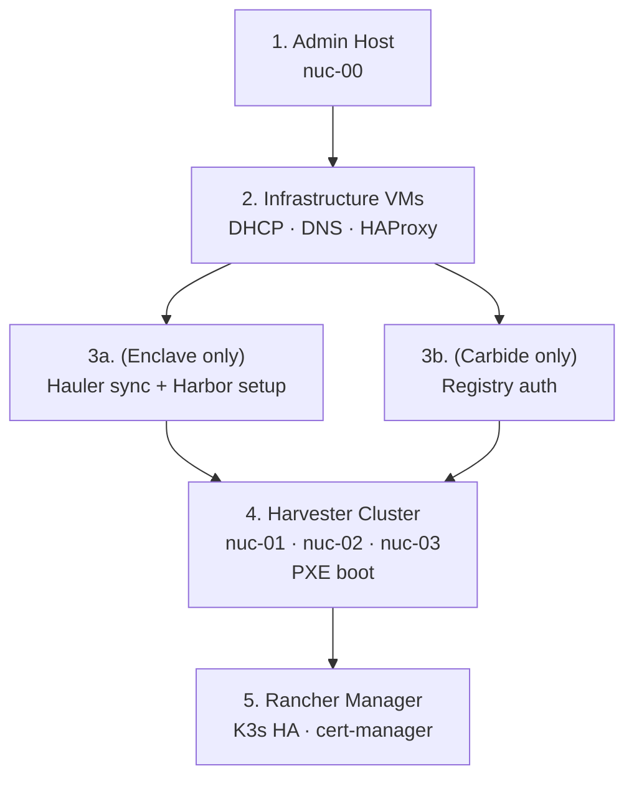

# Day 1 — Build

Initial deployment, strictly ordered. Each component depends on the previous one being verified and healthy before proceeding.

## Before You Begin

1. Complete all [Day 0](../day-0/day-0.md) planning
2. Set your environment:

```bash
export ENVIRONMENT=community   # or carbide, enclave
source Scripts/env.sh
```

3. Verify prerequisites with:

```bash
bash Scripts/00_preflight.sh
```

## Build Order



**Do not skip steps.** DNS must be running before Harvester can discover its own nodes. Harvester must be healthy before you deploy Rancher Manager inside it.

## Step-by-Step

### 1. Build the Admin Host

Install and configure `nuc-00` with KVM, Apache, and TFTP. See [Admin Host](./admin-host.md).

### 2. Deploy Infrastructure VMs

Launch the three infra VMs on `nuc-00`:
- `nuc-00-01` — DHCP, DNS primary, TFTP
- `nuc-00-02` — DNS secondary
- `nuc-00-03` — HAProxy, Keepalived

See [Infrastructure VMs](./infrastructure-vms.md).

### 3a. (Enclave only) Hauler and Harbor

```bash
bash Scripts/modules/enclave/hauler_sync.sh
bash Scripts/modules/enclave/harbor_setup.sh
```

### 3b. (Carbide only) Registry Auth

```bash
bash Scripts/modules/carbide/registry_auth.sh
```

### 4. Build the Harvester Cluster

PXE boot `nuc-01`, `nuc-02`, `nuc-03` in order. The first node creates the cluster; subsequent nodes join. See [Harvester Cluster](./harvester-cluster.md) and [PXE Boot](./pxe-boot.md).

```bash
bash Scripts/02_setup_ca.sh
bash Scripts/07_post_configure_harvester.sh
```

### 5. Deploy Rancher Manager

```bash
bash Scripts/10_install_rancher_manager.sh
```

See [Rancher Manager](./rancher-manager.md).

## What You'll Have After Day 1

- Fully operational Harvester cluster with distributed storage
- Rancher Manager running in high-availability mode inside Harvester
- All infrastructure services healthy (DHCP, DNS, HAProxy)
- Certificate authority in place for internal TLS
- Ready for Day 2 workload deployment
