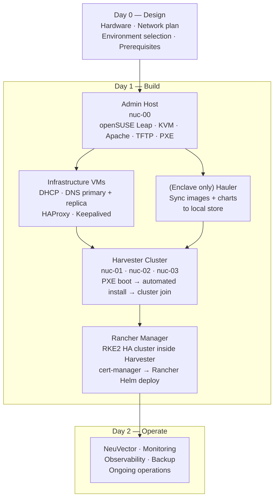

# Architecture Overview

A single-codebase deployment framework for building a Kubernetes homelab using SUSE Rancher, Harvester, and related tooling — across Community, Carbide, and Enclave environments.

This repository contains the scripts, configuration files, and documentation for deploying the full SUSE/RGS stack on small form-factor hardware (Intel NUCs). It is designed to be run against three distinct deployment environments using a shared codebase, with environment-specific behavior driven entirely by configuration.

> **Note:** This is not an official SUSE or RGS repository. It is a personal lab environment designed to explore and demonstrate the platform using straightforward, repeatable methods.

---

## Goals

- Single codebase that can build out a complete environment end-to-end
- Environment selection via a single config variable — no forking, no duplicating scripts
- Deploy: Harvester (virtualization), RKE2, Rancher Manager, SUSE Observability, and a workload cluster with NeuVector
- Human-readable documentation that explains not just *what* to run, but *why*

---

## The Three Environments

| Environment | Description | CIDR | Domain |
|:-----------:|:------------|:----:|:-------|
| **Community** | SUSE/upstream bits pulled from public registries | 10.0.0.0/22 | community.kubernerdes.com |
| **Carbide** | RGS software pulled from the RGS registry over the internet | 10.10.12.0/22 | carbide.kubernerdes.com |
| **Enclave** | RGS software synced via Hauler, served from a local Harbor registry (air-gapped) | 10.10.12.0/22 | enclave.kubernerdes.com |

Carbide and Enclave share the same CIDR — they are never deployed simultaneously. They represent different software delivery approaches on the same physical hardware.

**Milestones:** Community MVP → Carbide → Enclave

---

## The Software Stack

The homelab is built in layers, each one depending on the one below it.

### Layer 1 — Infrastructure Services

Before any Kubernetes cluster can exist, the network must be stable and discoverable. A dedicated admin host (`nuc-00`) runs a set of KVM virtual machines that provide foundational network services:

- **DHCP** — assigns IP addresses to all nodes as they come online
- **DNS** — resolves cluster hostnames and API endpoints
- **HAProxy + Keepalived** — distributes traffic across the Harvester cluster and Rancher Manager, presenting stable virtual IP addresses (VIPs) that survive individual node failures

These services must be healthy before anything else can be built.

### Layer 2 — Harvester HCI

[Harvester](https://harvesterhci.io) is an open-source hyperconverged infrastructure (HCI) platform built by SUSE on top of Kubernetes. The three Harvester nodes (`nuc-01`, `nuc-02`, `nuc-03`) form a cluster that manages both virtual machines and Kubernetes workloads on the same underlying hardware.

Harvester is installed via PXE boot: the admin host serves the Harvester installer and per-node configuration over the network, enabling fully automated, unattended installation across all three nodes.

### Layer 3 — Rancher Manager

[Rancher Manager](https://rancher.com) is SUSE's multi-cluster Kubernetes management platform. In this homelab, it runs as a highly available RKE2 cluster inside Harvester — three VMs, each scheduled on a different Harvester node, fronted by a HAProxy VIP.

### Layer 4 — RGS Carbide and Hauler (Carbide/Enclave only)

[RGS Carbide](https://ranchergovernment.com/carbide) is Rancher Government Solutions' hardened distribution of the Rancher stack, providing signed, FIPS-capable images with cryptographically verifiable provenance.

[Hauler](https://docs.hauler.dev) handles artifact management for the Enclave environment — syncing container images, Helm charts, and other artifacts from external sources into a local content-addressed store, making true air-gap operation possible.

### Layer 5 — NeuVector

[NeuVector](https://neuvector.com) provides runtime container security, continuous vulnerability scanning, and network policy enforcement inside the cluster.

---

## How Environment Switching Works

All environment differences are contained in two places:

1. **`Scripts/env.d/${ENVIRONMENT}.sh`** — variables that differ between environments (registry URLs, credentials, chart sources). The common `env.sh` sources this file automatically based on the `ENVIRONMENT` variable.

2. **`Files/overrides/${ENVIRONMENT}/`** — configuration files that need to differ from the common baseline (e.g., Harvester registry mirror config pointing to Harbor instead of Docker Hub).

The numbered scripts (`02_`, `10_`, `20_`, etc.) contain **no environment conditionals**. They read from `env.sh` and behave correctly for whichever environment is active.

```bash
export ENVIRONMENT=community   # or carbide, enclave
source Scripts/env.sh
```

---

## The Day 0 / 1 / 2 Framework

| Phase | Focus | Key Question |
|-------|-------|--------------|
| **Day 0 — Design** | Decisions made before anything is installed | What does this need to look like, and do we have everything we need? |
| **Day 1 — Build** | Initial deployment, strictly ordered | Is each layer healthy before the next one begins? |
| **Day 2 — Operate** | Ongoing health, security, and maintenance | Is the homelab still doing what we designed it to do? |

---

## Build Sequence



---

## Source Repository

All automation, scripts, and configuration live at:
[homelab.kubernerdes.com](https://github.com/jradtke-rgs/homelab.kubernerdes.com)
